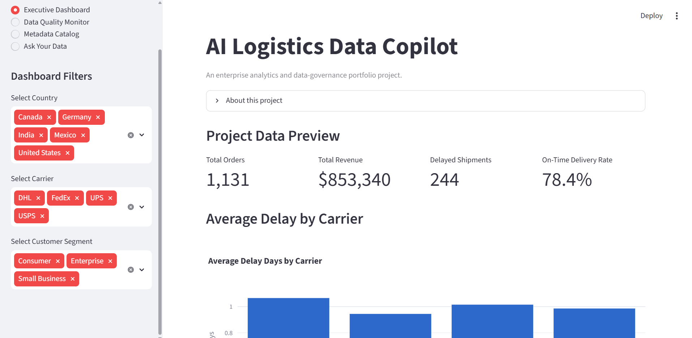
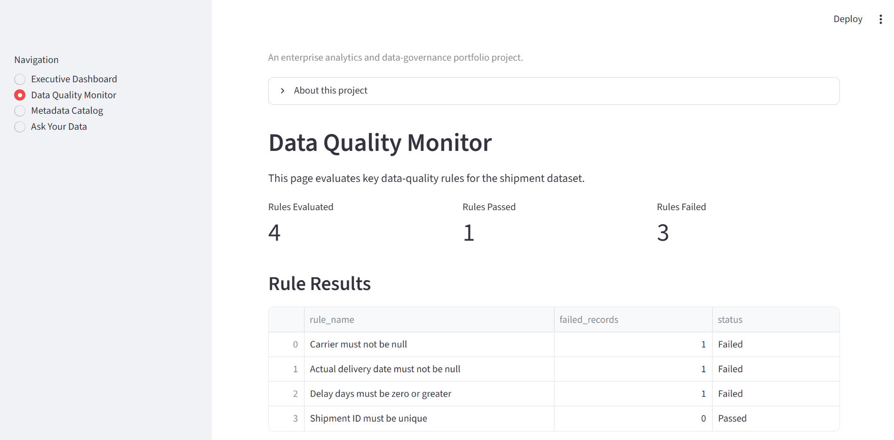
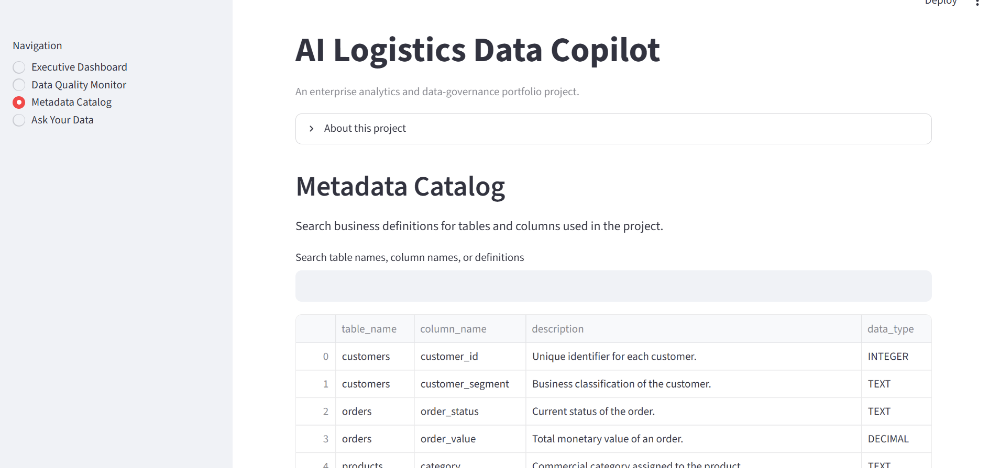
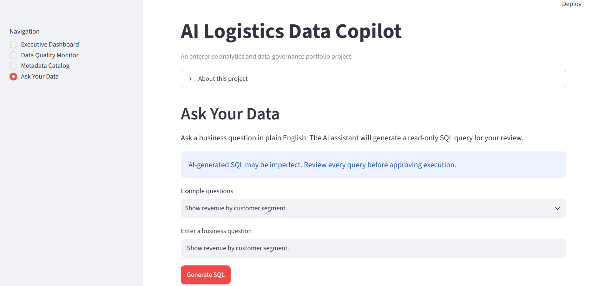

# AI Logistics Data Copilot

An enterprise-style AI analytics and data-governance
application built with Python, SQL, Streamlit, Plotly,
SQLite, Pandas, and the OpenAI API.

## 🚀 Live Demo
[Launch the AI Logistics Data Copilot] https://ai-logistics-data-copilot-gzxjsg7ctuqcqwvd5rhxbs.streamlit.app/

## Project Overview

The AI Logistics Data Copilot allows business users to:

- Explore logistics performance
- Monitor data-quality issues
- Search metadata definitions
- Ask business questions in natural language
- Generate read-only SQL
- Review queries before execution
- Receive AI-generated business summaries

## Business Problem

Business teams often depend on analysts for routine questions
about revenue, customers, orders, carriers, and shipment delays.

Data definitions may be difficult to locate, and data-quality
issues can reduce trust in reporting.

This project combines analytics, metadata management,
data-quality monitoring, and generative AI in one application.

## Features

- Executive KPI dashboard
- Interactive filters
- Revenue and shipment visualizations
- Data-quality monitoring
- Searchable metadata catalog
- Natural-language-to-SQL generation
- Human approval before query execution
- Read-only SQL validation
- AI-generated business summaries
- Automatic result visualization

## Technology Stack

- Python
- Pandas
- SQLite
- SQL
- Streamlit
- Plotly
- OpenAI API
- Faker
- GitHub

## Architecture

Synthetic data generation  
→ CSV source files  
→ SQLite database  
→ Python query layer  
→ Streamlit interface  
→ AI SQL generation  
→ Human approval  
→ Query execution  
→ AI business summary

## Governance Controls

- SELECT-only SQL
- Blocked modification commands
- Human review before execution
- API credentials stored outside source code
- Limited query-result context sent to the AI
- No direct AI database modification

## Example Questions

- Which carrier has the highest average delay?
- Show delayed shipments by country.
- Which product category generated the most revenue?
- Show revenue by customer segment.
- Show monthly revenue.
- Show the top five customers by total order value.

## Screenshots









## Run Locally

Clone the repository:

```bash
git clone YOUR_REPOSITORY_URL