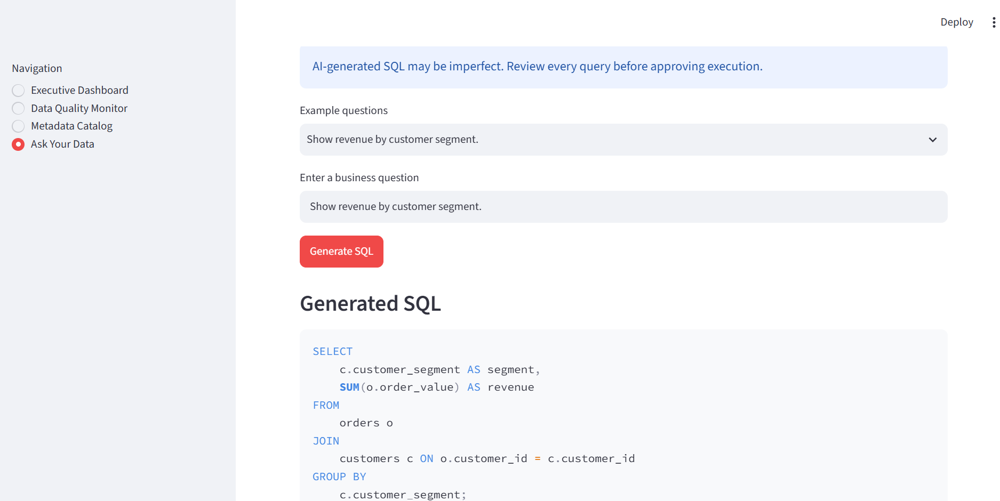

# 🚚 AI Logistics Data Copilot

An enterprise-style **AI-powered analytics and data governance application** that enables users to explore logistics data using natural language, monitor data quality, discover metadata, and generate business insights through a controlled AI-to-SQL workflow.

Built with **Python, SQL, Streamlit, SQLite, Pandas, Plotly, and the OpenAI API**.

## 🚀 Live Demo

[Launch the AI Logistics Data Copilot](https://ai-logistics-data-copilot-gzxjsg7ctuqcqwvd5rhxbs.streamlit.app/)

---

## 📌 Business Problem

Logistics teams often work with large volumes of customer, order, product, and shipment data spread across multiple datasets.

Business users may need insights from this data but may not know SQL or understand the underlying database structure. At the same time, organizations need controls around AI-generated queries, data quality, and traceability.

The **AI Logistics Data Copilot** demonstrates how Generative AI can be combined with traditional analytics and data governance practices to provide a safer, business-friendly analytics experience.

---

## ✨ Key Features

### 📊 Executive Dashboard
Provides an interactive view of logistics performance using KPIs, filters, and visualizations to help users quickly identify operational trends.

### 🛡️ Data Quality Monitor
Evaluates logistics datasets for common data quality issues and provides visibility into the reliability of the underlying data.

### 📚 Metadata Catalog
Allows users to explore database tables, columns, and schema information, improving data discovery and understanding.

### 🤖 Natural Language to SQL
Users can ask business questions in plain English and the application uses an LLM to generate the corresponding SQL query.

Example questions:

- Which customers have placed the most orders?
- What are the top products by order volume?
- Which shipments have the longest delivery times?
- How many orders were placed by each customer?

### 👤 Human-in-the-Loop Query Approval
AI-generated SQL is displayed to the user before execution. The query runs only after explicit user approval.

This provides an additional control between AI generation and database execution.

### 🔒 SQL Safety Controls
The application validates generated SQL and restricts execution to read-only analytical queries, helping prevent destructive database operations.

### 💡 AI-Generated Business Insights
After an approved query is executed, the application can convert query results into a concise business-oriented summary.

### 📈 Automatic Query Visualization
When query results contain suitable categorical and numeric fields, the application automatically creates a visualization using Plotly.

### 🕒 Persistent AI Query History
Approved AI queries are stored in SQLite with:

- Business question
- Generated SQL
- Execution timestamp
- Number of rows returned

This creates a lightweight audit trail for AI-assisted analytics.

---

## 🧠 Responsible AI Design

The project includes several controls designed to demonstrate responsible use of Generative AI in analytics:

**Human approval**

AI-generated SQL is presented for review before execution.

**Read-only SQL validation**

Potentially destructive database operations are blocked.

**Controlled database execution**

Only validated queries are sent to the database.

**Auditability**

Approved queries and execution metadata are recorded in persistent query history.

**Credential protection**

API credentials are stored outside source control using environment variables and Streamlit Secrets.

**AI transparency**

The application identifies AI-generated outputs and includes appropriate disclaimers.

---

## 🏗️ Application Architecture

```text
                    Business User
                         │
                         ▼
                  Natural Language
                     Question
                         │
                         ▼
                    OpenAI API
                         │
                         ▼
                AI-Generated SQL
                         │
                         ▼
                SQL Safety Validation
                         │
                         ▼
                 Human Review / Approval
                         │
                         ▼
                    SQLite Database
                         │
                         ▼
                    Query Results
                    ┌────┴─────┐
                    ▼          ▼
               Visualization   AI Business
                  (Plotly)        Summary
                    │
                    └────┬─────┘
                         ▼
                 Query Audit History
```

---

## 🛠️ Technology Stack

| Technology | Purpose |
|---|---|
| Python | Application logic and data processing |
| Streamlit | Interactive web application |
| SQL | Analytical querying |
| SQLite | Relational data storage |
| Pandas | Data manipulation and analysis |
| Plotly | Interactive data visualization |
| OpenAI API | Natural-language-to-SQL and AI summaries |
| Faker | Synthetic logistics data generation |
| Git & GitHub | Version control and project hosting |
| Streamlit Community Cloud | Application deployment |

---

## 📸 Application Screenshots

### Executive Dashboard


### Data Quality Monitor


### Metadata Catalog


### AI-Generated SQL


### AI Query Result



---

## 🔄 AI Analytics Workflow

```text
Business Question
       ↓
LLM Generates SQL
       ↓
SQL Safety Validation
       ↓
Human Reviews Generated Query
       ↓
Approved Query Executes
       ↓
Results Displayed
       ↓
Automatic Visualization
       ↓
AI Business Summary
       ↓
Query Stored in Audit History
```

This workflow demonstrates how Generative AI can be incorporated into analytics while maintaining **human oversight, query controls, and traceability**.

---

## 📁 Project Structure

```text
ai-logistics-data-copilot/
│
├── app.py
├── ai_service.py
├── database.py
├── data_quality.py
├── generate_data.py
├── requirements.txt
├── README.md
├── logistics.db
│
├── data/
│   └── synthetic logistics datasets
│
└── screenshots/
    └── application screenshots
```

### Core Components

**`app.py`**  
Streamlit application interface, navigation, dashboards, AI query workflow, visualizations, and query history UI.

**`ai_service.py`**  
Handles OpenAI integration, natural-language-to-SQL generation, SQL safety validation, and AI-generated business summaries.

**`database.py`**  
Handles SQLite database creation, dashboard data retrieval, analytical query execution, and persistent AI query history.

**`data_quality.py`**  
Contains logic used by the Data Quality Monitor to evaluate dataset quality.

**`generate_data.py`**  
Generates synthetic logistics datasets used by the application.

---

## ▶️ Run Locally

### 1. Clone the repository

```bash
git clone https://github.com/Sanjana-Kaushik/ai-logistics-data-copilot.git
cd ai-logistics-data-copilot
```

### 2. Create a virtual environment

```bash
python -m venv venv
```

### 3. Activate the environment

Windows:

```bash
venv\Scripts\activate
```

macOS/Linux:

```bash
source venv/bin/activate
```

### 4. Install dependencies

```bash
pip install -r requirements.txt
```

### 5. Configure the OpenAI API key

Create a `.env` file:

```text
OPENAI_API_KEY=your_api_key_here
```

Do not commit API credentials to source control.

### 6. Start the application

```bash
streamlit run app.py
```

---

## 🔐 Security

Sensitive credentials are excluded from the Git repository using `.gitignore`.

The deployed application uses **Streamlit Secrets** to securely provide API credentials at runtime.

AI-generated SQL is also subject to application-level safety validation and human approval before database execution.

---

## 🎯 Skills Demonstrated

This project demonstrates practical experience with:

- Generative AI application development
- LLM integration
- Prompt-driven natural-language-to-SQL
- SQL and relational databases
- Data analytics and visualization
- Data quality monitoring
- Metadata and data governance concepts
- Human-in-the-loop AI controls
- Responsible AI design
- Python application development
- Streamlit application development
- API integration
- Git/GitHub version control
- Cloud application deployment

---

## 🔮 Future Enhancements

Potential enhancements include:

- Role-based access control
- Support for enterprise databases such as Snowflake
- Semantic metadata search
- Advanced AI query evaluation
- Data lineage visualization
- Query performance monitoring
- Expanded data quality rules
- Exportable analytics reports

---

## 👩‍💻 Author

**Sanjana Kaushik**

Data & Business Intelligence Analyst focused on analytics, data governance, SQL, Python, BI, and applied Generative AI.

[View the Live Application](https://ai-logistics-data-copilot-gzxjsg7ctuqcqwvd5rhxbs.streamlit.app/)